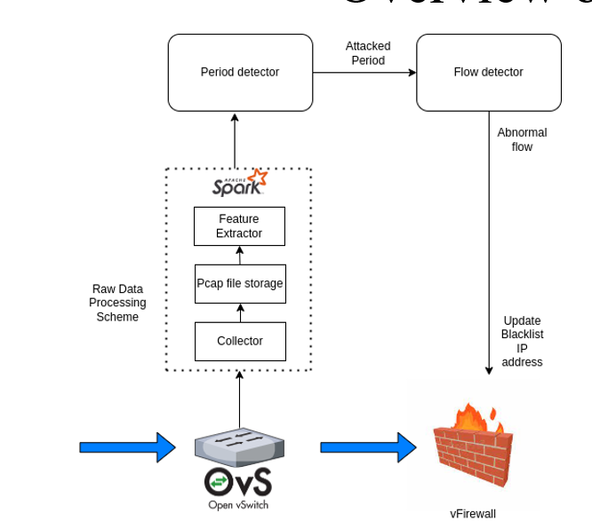

# Two-phase-Deep-learning-based-EDoS-Detection-System
This source code is used for the project two-phase deep learning based EDoS detection system

Cloud computing is currently considered the most cost-effective platform for offering business and consumer IT services over the Internet. However, it is prone to new vulnerabilities. A new type of attack, called an economic denial of sustainability (EDoS) attack, exploits the pay-per-use model to scale up the resource usage over time to the extent that the cloud user has to pay for the unexpected usage charge. In this project, we proposed a two-phase deep learning-based detection system to detect EDoS attack. The first phase called the prediod detector will detect where there is an attack in a period of 5s and then trigger the second phase detector if there is an attack in that 5-second period. The second detector called the flow detector will detect abnormal flows in the abnormal period detected by the first detector.


## Prerequisites
- Create and activate a virtual conda environment:
```bash
conda create -n edos python=3.11
conda activate edos
```
- Install dependencies:
```bash
./setup.sh
```
## How to run it
```bash
./two_phase_EDoS_detector.sh
```
## Others
- Please read `two_phase_EDOS.pdf` to understand the solution and read the `process-steps.pptx` to understand more about techical installation

If you use this source code, please cite this publication: 
```Bash
"Nhu, C.-N.; Park, M. Two-Phase Deep Learning-Based EDoS Detection System. Appl. Sci. 2021, 11, 10249. https://doi.org/10.3390/app112110249"
```
